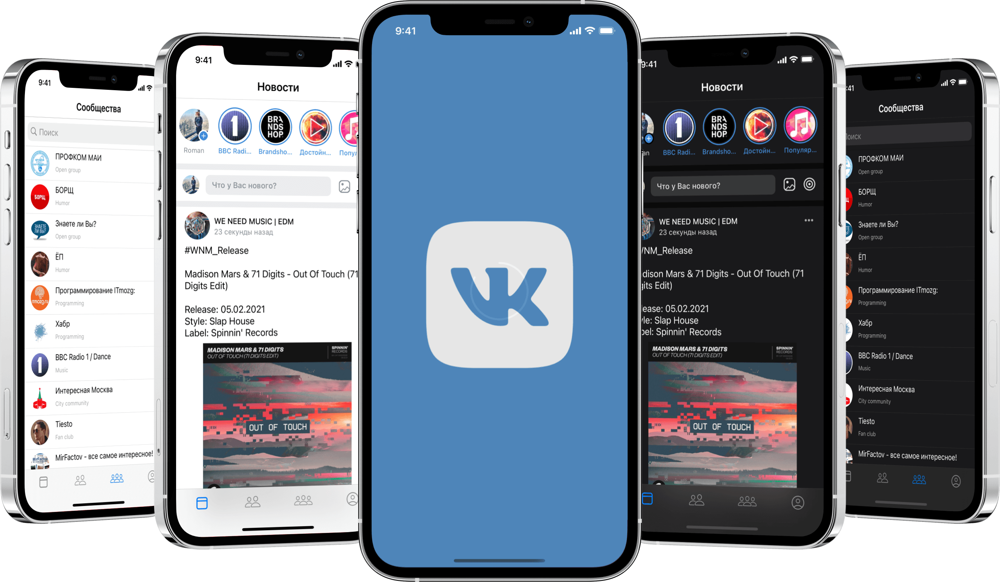
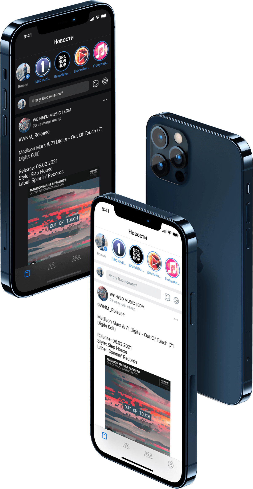
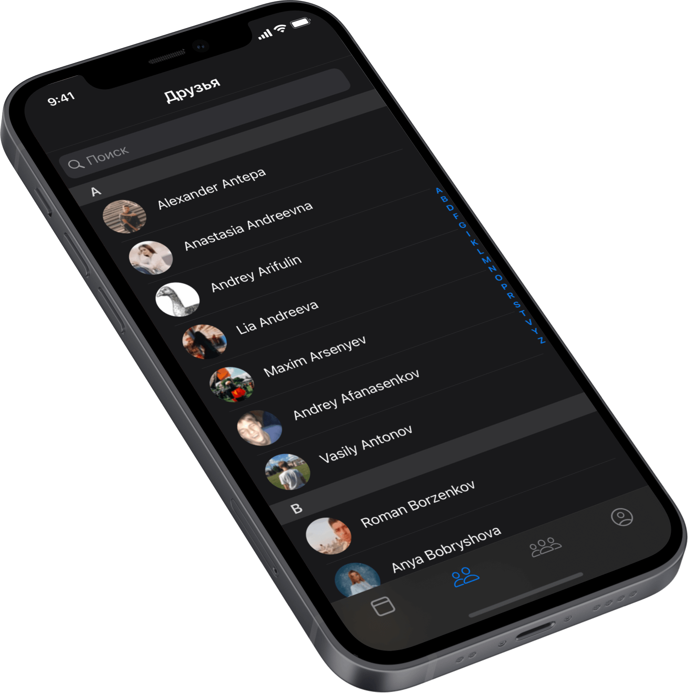
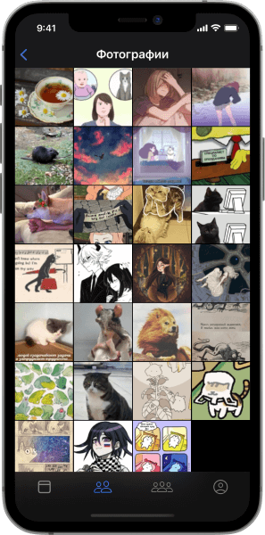
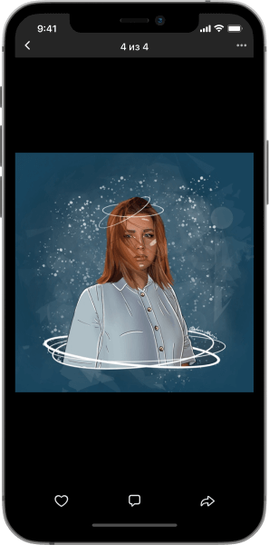
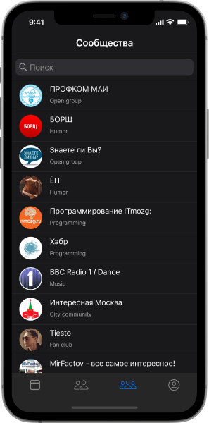
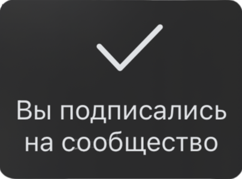
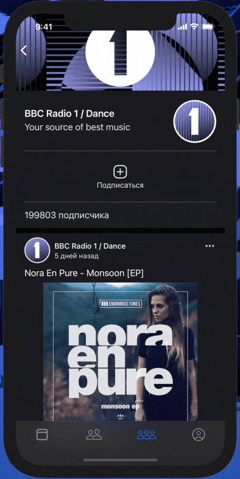
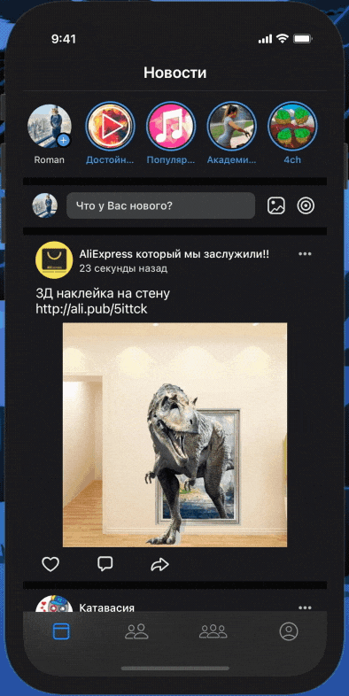

# VKClientSample

   

 <b>Клиент социальной сети "ВКонтакте"</b> 

  
  
  
  
  
  

 
 ## Содержание
- [Цель проекта](#цель-проекта)
- [Задачи проекта](#задачи-проекта)
- [Функционал](#функционал)
- [Экраны](#экраны)
  - [Новости](#новости)
  - [Друзья](#друзья)
    - [Галерея фотографий](#галерея-фотографий)
    - [Просмотр фотографий](#просмотр-фотографий)
  - [Сообщества](#сообщества)
  - [Страница сообщества](#страница-сообщества)
- [Фичи](#фичи)
  - [Онлайн статус](#онлайн-статус)
  - [Кастомный алерт](#кастомный-алерт)
  - [Кастомный ActivityIndicator](#кастомный-activityindicator)
  - [Хедер сообщества](#хедер-сообщества)
- [Используемые технологии](#используемые-технологии)
- [Лицензия](#лицензия)
 
 ## Цель проекта 
Получить навыки разработки iOS-приложений и работы с основными инструментами.
 
## Задачи проекта 
- Получить навыки построения интерфейса при помощи Storyboard и Xib, а также кодом и при помощи SnapKit
- Познакомиться с основными видами ViewController'ов
- Познакомиться с основыми элементами построения пользовательского интерфейса
- Получить навыки работы с переходами между ViewController'ами
- Получить навыки работы с сетью при помощи Alamofire
- Получить навыки работы с документацией к API
- Познакомиться со средством для сохранения данных на устройстве Realm
- Получить навыки построения кастомных View
- Получить навыки реализации базовой бизнес логики
- Получить навыки навыков работы с CocoaPods
- Получить навыки навыков работы с Git
 
 ## Функционал

 ### Core
- [x] Авторизация в социальной сети "ВКонтакте"
- [x] Получение данных с помощью API ВКонтакте
- [x] Сохранение списка друзей, групп в памяти устройства
- [x] Загрузка и кеширование изображений
- [x] Локализация на русский и английский языки
- [x] Кастомная анимация перехода между экранами

 ### Новости
- [x] Отображение ленты новостей пользователя
- [x] Отображение превью историй пользователя
- [x] Возможность "лайкнуть" пост
- [x] Получение свежих новостей с помощью pull-to-refresh
- [x] Prefetching новостей при пролистывании ленты

 ### Друзья
- [x] Отображение друзей пользователя
- [x] Отображение статуса онлайн у друзей и пользователя
- [x] Поиск друзей
- [x] Галерея фотографий друзей
- [x] Просмотр фотографий друзей с помощью свайпов

 ### Сообщества
- [x] Отображение сообществ пользователя
- [x] Поиск сообществ
- [x] Отображение информации о сообществе
- [x] Отображение ленты сообщества
- [x] Возможность вступить/покинуть сообщество

 ### TODO
- [ ] Отображение профиля друга
- [ ] Отображение профиля пользователя
 
## Экраны 
 
  ### Авторизация
  Экран авторизации является WebView, на котором пользователь входит в аккаунт. После успешного ввода данных приложение получает токен и id пользователя. В дальнейшем при всех запросах используется токен пользователя.
 
  ### Новости
   После авторизации пользователь попадает на экран с новостями и происходит запрос к API, а затем ответ парсится. На данном экране выводятся превью историй, поле "Что нового?" и новостная лента. Новостная лента включает в себя фотографию и имя автора, дату публикации, текст новости, изображения (если оно имеется), количество лайков, комментариев, репостов. Пользователя может нажать на кнопку "Мне нравится" и иконка анимировано заполнится и станет красного цвета.

  

 
 ### Друзья
   Данный экран является UITableViewController, на котором отображен список друзей пользователя и строка поиска. Поиск происходит по фамилии друзей. Список друзей разделен на секции по первой букве фамилии. Навигация по секциям может осуществляться с помощью контрола. При нажатии на ячейку друга выполняется  переход на экран с фотографиями выбранного друга. 
   Фотографии кешируются и список друзей друзей сохраняется на устройстве при помощи Realm.

  

 
 #### Галерея фотографий
 Галерея представляет собой UICollectionViewController с кастомных layout, ячейки которого заполнены всеми фотографиями пользователя.
 

  

 
 #### Просмотр фотографий
 На данном экране пользователь может просматривать фотографии своего друга с помощью свайпов. Также пользователь может скрыть экран свайпом вниз.

  

 ### Сообщества
   На данном экране отображаются сообщества, в которых состоит пользователь. Также доступна строка поиска при помощи которой пользователь может искать иные сообщества.
   

  

 
  ### Страница сообщества
  На данном экране отображается состоит ли пользователь в сообществе, количество подписчиков и новостная лента. Реализован растягивающийся хедер при свайпе сверху-вниз. Также доступна возможность вступить/покинуть сообщество. При попытке покинуть сообщество появляется UIAlertController с actionSheet для дополнительной проверки намерения пользователя. После вступления/покидания сообщества появляется кастомный алерт, сообщающий об успешности действия.
  

  

 
## Фичи 
 
 ### Онлайн статус
 
 
   
 Реализован статус онлайн для друзей как с мобильного устройства, так и ПК.
   
 
 ### Кастомный алерт
 

При вступлении/выходе из сообщества отображается данный алерт, сообщающий об успешности действия. Также с помощью UIBezierPath реализованы иконки "Галочка" и "Крестик", появление которых анимировано при помощи CAShapeLayer и CABasicAnimation.

  

  

 ### Кастомный ActivityIndicator
 

 
 
 C помощью CAShapeLayer был реализован кастомный ActivityIndicator, у которого можно запустить/остановить анимацию вращения. Данный индикатор используется при авторизации и на экране с новостями вместо стандартного UIActivityIndicator.
   
 Также реализован метод, с помощью которого при pull действии на экране новостей индикатор заполнется в зависимости от того насколько сильно пользователь потянул. Данный механизм сделан по подобию оригинально приложения "ВКонтакте".

 

  

 
 ### Хедер сообщества
 
 Реализован растягивающийся хедер сообщества, который при пролистывании сообщества закрывается фоном NavigationBar. На светлой теме при пролистывании меняется цвет кнопки "Назад" на синий, так как на белом фоне её становится не видно.

  

## Используемые технологии

 При создании данного проекта использовались следующие инструменты :

 - UIKit
   + UITableViewController/UITableView - экран с новостями, друзья, сообщества.
   + UITableViewPrefetch - предварительная загрузка старых новостей.
   + UICollectionViewController/UICollectionView - экран с галереей фотографий пользователя.
   + UITabbar
   + UINavigationController
   + UISearchBar - поиск друзей и сообществ.
   + UIImageView
   + CALayer и CAShapeLayer - кастомный ActivityIndicator, тени вьюшек.
   + UILabel
   + UIGestureRecognizer - пролистывание фотографий, dismiss экранов.
   + CoreAnimation
 - CocoaPods
   + [Alamofire](https://github.com/Alamofire/Alamofire) - a HTTP networking library.
   + [Realm](https://github.com/realm/realm-cocoa) - a mobile database that runs directly inside phones, tablets or wearables.
   + [Kingfisher](https://github.com/onevcat/Kingfisher) - a library for downloading and caching images from the web.
   + [SnapKit](https://github.com/SnapKit/SnapKit) - a DSL to make Auto Layout easy.

## Лицензия
[MIT License](./LICENSE)
